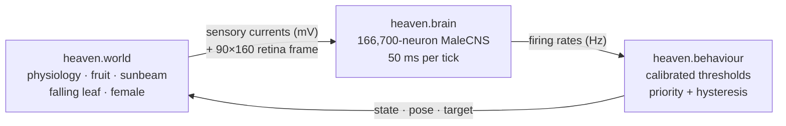

# Fly Haven: giving a real fly brain a forest to live in

*September 2026*

A few days ago this repository was a notebook that reran two other people's
connectome experiments. Now it's a forest floor in the browser. Up to four
rigged houseflies wander around it, and each one is driven live by its own
copy of the full 166,700-neuron MaleCNS v1.0 fruit-fly brain. When a fly eats,
basks belly-up or sings to a female, that behaviour was gated by real
annotated neurons crossing calibrated thresholds. It also sends a pulse into
the fly's dopamine cells, and a gauge on the page glows.

This post covers how we got there. It includes the parts that didn't work and
the line we kept drawing between what the connectome decides and what is just
presentation.

---

## TL;DR

- **Reproduced two published connectome experiments** on the MaleCNS v1.0
  wiring diagram in one notebook, [`fly-heaven.ipynb`](../fly-heaven.ipynb).
  Fruitless matched in all 36 runs, down to event hashes. Fly/Wirehead
  matched every published value, but only after we found that the result
  depends on whether the C++ compiler **fuses multiply-adds**.
- **Closed the loop** in [`heaven/`](../heaven/). A scripted world sends
  sensory currents into the full connectome, the connectome's firing rates
  pass through calibrated thresholds, and the resulting behaviour acts back
  on the world, every 50 ms of neural time.
- **Rendered it as a film** with Blender. A continuous, chronological macro
  shot follows a rigged BlenderKit housefly on a forest floor built entirely
  in code.
- **Built a live web version** in [`web/`](../web/). It uses Three.js, runs
  one brain process per fly, has a real soma atlas you can rotate, solid
  foods and "infinite dopamine".
- **Spun off a side project.** [fly-chess](https://github.com/Aananda-giri/fly-chess)
  grafts a trainable cortex onto the same frozen connectome and teaches it
  chess. It grew up here and now lives in its own repository.

---

## 1. One wiring diagram, two experiments

Everything starts from the **MaleCNS v1.0** connectome, published by FlyEM at
Janelia, Cambridge/MRC LMB and Google Research under CC-BY. Two open-source
projects had already built simulations on top of it:

| | [Fruitless](https://github.com/nicodunks/fruitless) | [Fly / Wirehead](https://github.com/mattyhempstead/fly-wirehead) |
|---|---|---|
| Question | Does blocking the mAL "brake" let male sensory cues excite P1 courtship neurons? | What does a connectome do while it "watches" insect Shorts with a dopamine drive? |
| Graph | 166,606 neurons, 25.57 M connections | 166,700 neurons, 25.58 M connections |
| Model | Numba LIF, bounded inhibitory conductance | C++ LIF with candidate KC→MBON plasticity |

Both are git submodules under [`experiments/`](../experiments/). The notebook
downloads the shared ~1.1 GB of source data once, checks it against both
projects' SHA-256 locks and links it into each layout. Then it **imports each
project's own simulation code without modifying it** and checks the output
against what that project published. That "call their code, don't rewrite
it" rule stayed in place for everything built afterwards.

### Fruitless: disinhibition, not a preference switch

We reran the 36 paired 300 ms trials behind the headline result: 2
inhibitory-reversal assumptions × 3 input populations × 3 seeds × intact vs
mAL-blocked. **Every field of every run was identical to the committed
results**, including event hashes, P1 spikes, mAL spikes, network spikes and
minimum voltage.

| Input (−80 mV reversal) | Intact P1 spikes | mAL blocked |
|---|---|---|
| Candidate male cue (LgLG6/7) | 0, 0, 0 | **4, 7, 1** |
| Candidate female cue (LgLG5/8) | 10, 10, 9 | 21, 23, 22 |
| vAB3 relay, direct | 0, 0, 0 | 10, 15, 12 |

Removing the brake unmasks a small response to male cues. The female-cue
response is still larger, though, so this is disinhibition and not a flip in
preference. The project's own write-up is careful about that, and so is ours.

### Fly / Wirehead, and the float-rounding problem

The first attempt at Wirehead's full-network assay **did not match**. A
100 ms white screen produced 80,958 network spikes instead of the published
127,378. Only 5 plastic synapses changed instead of 3,087, and the project's
own `test_full_connectome.py` also failed on this machine.

The model isn't broken, it's chaotic. The kernel integrates in float32, and
small rounding differences grow into a different trajectory within 1.5 s of
conditioning. The published numbers came from Apple silicon, where clang
fuses multiply-adds (FMA) by default. On x86-64, the project's compiler flags
don't. Rebuilding the same source with `-mfma -ffp-contract=fast` reproduced
**every published value exactly**:

| Measure | Published | This machine (FMA build) |
|---|---|---|
| Network spikes, 100 ms white | 127,378 | 127,378 |
| Network spikes, 100 ms black | 92,952 | 92,952 |
| PAM11 spikes, 200 ms with 20 mV drive | 261 | 261 |
| Plastic synapses changed | 3,087 | 3,087 |
| Replay from checkpoint exact | ✔ | ✔ |

We then played the five Shorts at 20 fps into a fresh brain, with and
without the dopamine drive. PAM11 fired at about 90 Hz with the drive (the
project reported 84–97 Hz) and didn't fire at all without it. Whole-network
activity was 55k–63k spikes per 50 ms, and plasticity rewrote about 1,900
synapses without the drive and 3,400 with it. The takeaway: **the "dopamine"
here is the injected current, not a response to the video.**

The FMA build became the standard for everything that followed:
[`heaven/brain.py`](../heaven/brain.py) compiles and caches its own FMA copy
of the kernel.

---

## 2. Closing the loop: `heaven/`

Reproducing someone else's experiment is one thing. Next we wanted to know
whether the same brain could run a whole fly.



**The brain** ([`brain.py`](../heaven/brain.py)) chooses which annotated
cells receive current and which cells get read out. It doesn't touch the
wiring:

| Sense (cells) | → | Readout (cells) | Behaviour |
|---|---|---|---|
| sugar: LB3c labellar gustatory (23) | → | MN9 proboscis motor (2) | feed |
| antenna: JO-C/E Johnston's organ (335) | → | DNg12 grooming DNs (42) | groom |
| loom: LC4 visual projection (126) | → | DNp01 giant fiber (2) | escape |
| heat / cold: TRN_VP2 / VP3 (7 / 7) | → | MDN moonwalker (4) | thermoregulate |
| female: LgLG5/8 foreleg (27) | → | P1, pC1_4a/b (8) | court |

It also reads out pIP10 (song), DNa02 left/right (steering), all 708 VNC
motor neurons (speed) and the 15 PAM11 dopamine cells.

**Calibration** ([`calibrate.py`](../heaven/calibrate.py)) warms the brain up
on three visual scenes (dappled, bright, dark) and checkpoints it. From that
checkpoint it probes each sense at 10 and 20 mV for 300 ms, and sets each
threshold to half the median evoked-minus-baseline response. All five route
checks pass: sugar→MN9, antenna→DNg12, loom→GF, heat→MDN, and female cues
driving P1 harder than male cues.

**The behaviour layer** ([`behaviour.py`](../heaven/behaviour.py)) is a
priority stack: escape > courtship > feed > groom > thermoregulate > bask >
explore. It owns hysteresis, timing and poses. It never decides *whether* a
behaviour starts.

### What the connectome taught us about itself

Most of the interesting code in `heaven/` is a workaround for something
measured in the model:

- **Vision alone moves the baseline.** A bright frame raised resting MN9 to
  25 Hz with no sugar at all. So decisions gate on the phasic rise above a
  slowly tracked floor (τ = 4 s), the same evoked-minus-baseline measure
  calibration used.
- **Tiny readouts are noisy.** MN9, GF and pIP10 are 2 cells each, and a
  single 50 ms bin is Poisson noise. So entering a state requires 250 ms
  above threshold (400 ms for the 4-cell MDN), and escape is exempt because a
  startle has to be immediate.
- **Sustained current breaks the network.** Holding any sense on for more
  than about 10 s pushed the recurrent network into a persistently elevated
  state that lasted tens of seconds after the stimulus ended. Weights were
  frozen, so this wasn't learning. Every held sense is therefore delivered as
  a **0.3 s-in-1 s pulse train**, within the envelope calibration validated.
- **So a continuous readout can't answer "should I keep doing this?"** Only
  a calibrated onset is reliable. Feeding, grooming and thermoregulation are
  *bouts*: the brain starts one, and it runs until the fly is full, clean or
  comfortable, or hits a safety cap.
- **MN9 isn't a pure feeding channel.** Heat alone raises it, so feeding
  also requires contact with the fruit, just as real proboscis extension
  needs gustatory contact.

Lesion runs (`--lesion MN9 | P1 | GF | DNg12`) silence a readout population at
−40 mV, which confirms that each behaviour depends on the route claimed for
it.

---

## 3. The film: Blender

The first presentation was an offline film. The pipeline goes:

1. [`build_world.py`](../heaven/blender/build_world.py) builds a
   metre-scaled macro forest floor in code, from a fixed seed.
2. [`animate.py`](../heaven/blender/animate.py) bakes the **Housefly-Exotic
   Rigged** asset (Joachim Bornemann, BlenderKit) for the male and female,
   plus one continuous macro camera, from the simulation timeline.
3. [`director.py`](../heaven/director.py) cuts clips at the
   timeline's own state changes, so every boundary is where the connectome
   actually switched a behaviour on or off, never a hand-picked timestamp.
   The default is now **continuous and chronological**; the old highlight
   reel needs `--highlights`.
4. [`render.py`](../heaven/blender/render.py) plus
   [`finish_film.py`](../heaven/blender/finish_film.py) run a resumable
   Cycles/OptiX render. A scene checksum guards against stale frames, and the
   movie is encoded only once all 5,281 frames exist.
5. [`overlay.py`](../heaven/overlay.py) burns in captions from the same EDL.

[`motion.py`](../heaven/blender/motion.py) keeps the presentation honest
without importing Blender. State labels hold until their recorded onset, gait
phase follows distance travelled rather than firing rate, IK keeps feet
planted, and courtship spacing stops the simulation's point agents from
interpenetrating. The poses are illustrative, not biomechanical output.

---

## 4. A detour: fly-chess

In the middle of all this, a side question took over for a couple of days:
can a small trainable "cortex", grafted onto the **frozen** connectome, learn
chess?

The first notebook ran. A review then found real problems: the Stockfish
centipawn loss was scored from the wrong perspective, the PUCT backup sign
was wrong, the Elo estimate was unsupported and a lesion control was
unproven. The v2 rebuild fixed all of those and added:

- a 4,184-class move vocabulary covering every legal move including
  underpromotions;
- side-to-move value labels;
- controls: fly + linear readout, a parameter-matched "cortex in a jar," and
  a degree-preserving edge shuffle;
- win/draw/loss results with bootstrap confidence intervals instead of an
  invented Elo;
- crash-safe, exactly resumable runs.

Colab ports and resumable V3–V5.5 training notebooks followed. On
15 September it moved to
[its own repository](https://github.com/Aananda-giri/fly-chess) with its full
history, and this repo went back to being about one fly's life.

---

## 5. Fly Haven, live in the browser: `web/`

A film is fixed once rendered. We wanted to watch the loop run, so
[`web/`](../web/) runs it live.

### Architecture

```
browser (Three.js)  ──poll /api/flies every 150 ms──▶  web/server/app.py  (stdlib HTTP, loopback only)
      ▲                                                     │ spawns / reaps
      │  latest.json + activity.bin                         ▼
      └──────────────────────────────────────────  fly_worker.py × N   (one OS process = one brain)
                                                   FoodWorld → ConnectomeBrain → HeavenBehavior
```

Two measurements shaped this design:

- **One process per fly, not threads.** The compiled kernel doesn't release
  the GIL, and two brains stepped from two threads took about 2× as long as
  one.
- **One BLAS thread per process.** By default numpy started 35 threads *per
  process* on this 16-core machine. Four flies meant 140 threads, and each
  tick ran about 4× slower than a single fly. Pinning
  `OMP/OPENBLAS/MKL_NUM_THREADS=1` let the OS scheduler actually run the flies
  in parallel.

A brain advances 50 ms of neural time in roughly 150–300 ms of wall time, so
a fly lives at about **0.25–0.3× real time**. We don't fake a faster clock.
The browser interpolates the sparse ticks into 60 fps motion, and a
**flight speed** slider (0.25×–3×) changes only visual playback, never neural
timing.

### Infinite dopamine

Whenever a fly is eating, basking belly-up, or at any courtship stage from
song onwards, the worker injects a **20 mV pulse into its 15 PAM11 dopamine
cells**, the same magnitude Fly/Wirehead uses. Those moments trigger the real
reward circuitry, and the page shows it as a live PAM11 Hz gauge.

### Deliberate departures, and one that failed

Everything the web version changes from `heaven` is documented in the code,
and **no neural threshold or readout is touched**:

| Change | Why |
|---|---|
| Held bouts are shorter (SING 45 s → 8 s, MATE 14 s → 6 s, …) | At 0.3× real time, the film's timings alone would add hours before a courtship finished. |
| A male can court again 5 s after dismounting | In `heaven`, `has_mated` is permanent, so a mated fly spent the rest of the run with no reward current. Whether he courts again is still P1's call. |
| The female starts next to the fly's food, from tick one | Both of `heaven.world`'s fixed female spots are in cold shade. A male thermoregulated all the way there, turned back, and odd-seeded flies never courted. |
| Sustained female contact becomes the 0.3 s-in-1 s pulse train | A web male can hold contact for tens of seconds, and a constant 20 mV silenced P1 instead of driving it over threshold. |

**The failed attempt:** we first tried flattening `heaven`'s 17–34 °C weather
to a comfortable 23–27 °C. Headless runs showed that removed the thermal
drive P1 needs. The male held uninterrupted contact with the female and never
courted, and the reward fell to feeding alone (about 8%). We reverted it, so
`heaven`'s weather is used unmodified.

### Food that is actually solid

In `heaven.world`, fruit is a point the fly walks onto. In
[`food_world.py`](../web/server/food_world.py), foods are solid props: red and
green apples, banana, orange, melon, mango and wild berries, 20 placements in
all, imported from a low-poly food pack. A fly picks the nearest food, stops
at its surface, walks around foods in its way, and only then gets sugar
contact. Feeding still needs MN9 to cross its threshold. The worker and the
renderer share [`food-layout.json`](../web/food-layout.json), so collision
radii come from the visible geometry.

### A brain you can look inside

The brain panel is a separate, rotatable Three.js view of **real MaleCNS soma
positions**, stored in the kernel's own neuron order. 139,662 of the 166,700
neurons have soma coordinates (124,296 of them in the brain crop). Every
tick, each worker atomically writes an `activity.bin`: a 16-byte `FHB1` header
followed by one uint16 spike count per neuron. The page polls the stream for
the selected fly only. From there you can highlight real annotated circuits
(PAM11, P1, MN9, pIP10, DNg12, GF, DNa02, MDN, motor) or open the nerve cord.
The scan sweep is decorative, and the page says so: this is simulated
activity on reconstructed anatomy, not an acquired functional scan.

### The puppet

[`fly.js`](../web/fly.js)'s `FlyRig` is explicitly *"a puppet, not a brain"*.
It turns a pose name from the server into bone rotations. Feet use a short
CCD solve to keep ground contact, gait phase follows distance travelled, a
feeding fly dabs its proboscis onto the food mesh itself, and the belly-up
pose rolls around the thorax. [`navigation.js`](../web/navigation.js) keeps
bodies clear of rocks, twigs and leaves along interpolated paths. It is a
visual correction only and never feeds back into decisions.
`tools/pose-preview.html` previews every pose on the production rig without
starting a brain.

### What the live runs did

The runs saved under `runs/fly-haven-web/` so far cover **45 fly processes**
and **51,283 neural ticks**, about 43 minutes of simulated fly life. The
longest single fly ran 12,130 ticks, about 10 simulated minutes. At their last
recorded tick, 11 of the 45 were somewhere in courtship (5 singing, 1 mounting,
4 mating, 1 dismounting), 5 were feeding, 11 were thermoregulating and 18 were
exploring. The final ticks of those runs had a median wall time of about 1.1 s,
so the 150–300 ms figure above is a best case.

---

## 6. What's real and what's scripted

Every module in this repository comes back to this split:

| Decided by the connectome | Scripted or presentational |
|---|---|
| *Whether and when* the fly escapes, courts, feeds, grooms or thermoregulates (calibrated threshold crossings) | The world: weather, fruit, leaf fall, the female's movement |
| Walking speed (VNC motor rate) and turn bias (DNa02 L−R) | Long-range navigation to food and to the female (no odour or long-range courtship channel is modelled) |
| PAM11 firing under the reward current | *When* the reward current is applied |
| | Poses, IK, gait, camera, scenery, bout durations |

Limitations we keep repeating because they matter: transmitter signs and
input encodings are model assumptions, the 90×160 retina is a display proxy,
the housefly mesh stands in for a fruit fly, and nothing here shows that a
real fly feels pleasure, prefers anything or learns.

---

## 7. Tests

```sh
uv run python -m pytest -q tests   # 21 passed
node --test web/tests/*.test.mjs   # 12 passed
```

The Python suite covers the closed loop, the Blender motion sampling, and the
web presentation. The web tests check that the atlas keeps kernel order,
that sugar contact starts at the food surface, that the female waits outside
foods, that female contact is pulsed, that remating waits out its refractory
period, and that dopamine covers every courtship stage from song onwards.
The JavaScript tests cover navigation and spike-frame decoding.

---

## 8. Timeline

| Date | Milestone |
|---|---|
| 13 Sep | Repo assembled: submodules, `heaven` package, tests, reproduction notebook, first fly-chess notebooks. Fly-chess v2 correctness pass imported from a separate worktree; Colab ports. |
| 14 Sep | Resumable fly-chess training and comparison notebooks (V3–V5.5). |
| 15 Sep | Fly-chess split into its own repo; this repo trimmed back to the connectome work. |
| 15–16 Sep | `web/`: live multi-fly Three.js scene, per-fly brain workers, infinite dopamine, solid imported foods, soma-atlas brain view, pose preview, flight-speed control. |

---

## 9. Try it

```sh
uv sync
uv run jupyter lab fly-heaven.ipynb      # sections 0 and 2.1 prepare the graph

web/server/setup_data.sh                 # link the prepared graph + calibration
web/tools/build_housefly.sh              # build assets/housefly.glb
web/tools/build_food_pack.sh             # build the food variants
uv run python web/server/app.py          # http://127.0.0.1:8934
```

You need a C++17 compiler, WebGL 2 and about 525 MB of RAM per fly.

---

## Credits

- **MaleCNS v1.0**: FlyEM / Janelia, Cambridge / MRC LMB and Google Research
  ([downloads](https://male-cns.janelia.org/download/), CC-BY).
- **[fly-wirehead](https://github.com/mattyhempstead/fly-wirehead)** by
  @mattyhempstead, the brain kernel, retina and dopamine drive this whole project
  runs on (itself inspired by [Stonkfly](https://github.com/nftechie/stonkfly)).
- **[fruitless](https://github.com/nicodunks/fruitless)**, the P1/mAL
  experiment and the literature-mapped P1 cells used as the courtship readout.
- **Housefly-Exotic Rigged** by Joachim Bornemann (BlenderKit Royalty Free).
- **Three.js** (MIT) and **Draco** (Apache 2.0).
- Background literature: Kallman, Kim & Scott 2015; Clowney et al. 2015;
  Ryba et al. 2026; the [Shiu reference model](https://github.com/philshiu/Drosophila_brain_model).
